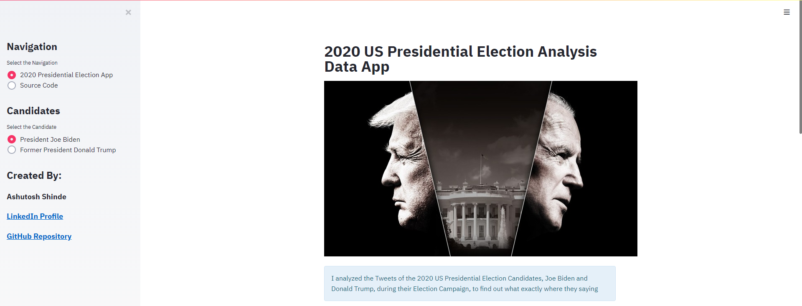
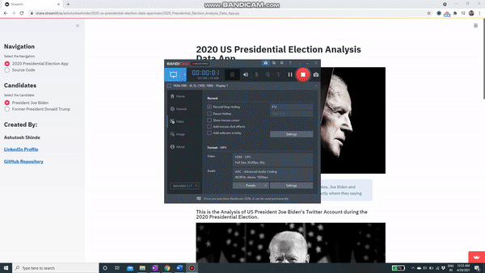

# 2020-US-Presidential-Election-Data-App

This repository consists of the code used in building an Application for performing the Sentiment Analysis of 2020 Presidential Election Candidates.

YouTube Link : https://www.youtube.com/watch?v=UIeNtC7ynMo

App Link : https://share.streamlit.io/ashutoshashinde/2020-us-presidential-election-data-app/main/2020_Presidential_Election_Analysis_Data_App.py

